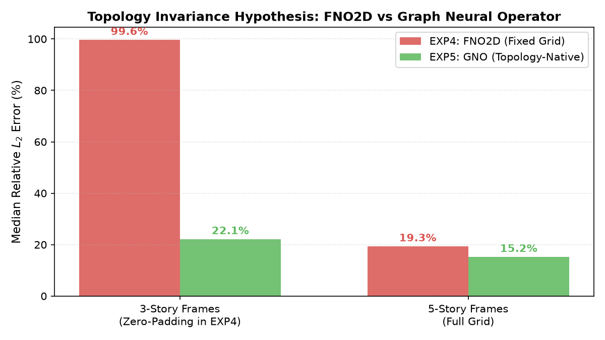
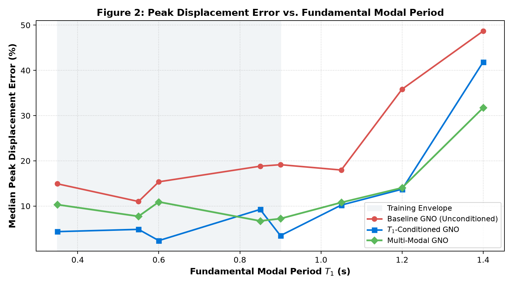
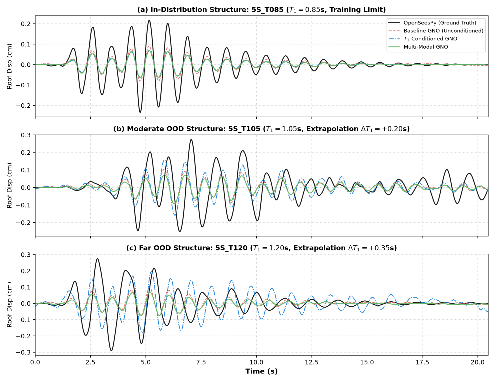

# SeismoFNO: Physics-Grounded Neural Operators for Seismic Structural Dynamics

[](#reproducibility)
[](#setup)
[-EE4C2C.svg?logo=pytorch&logoColor=white)](#setup)
[](#ground-truth-generation)
[](results/experiments/exp6/INDEPENDENT_FORENSIC_AUDIT.md)
[](https://seismofno-qp21.onrender.com)
[](LICENSE)

---

## What this project is

This repository documents a self-directed research project investigating whether neural operators can serve as fast, physically reliable surrogates for nonlinear seismic structural simulation. The core computation that motivates everything is the matrix equation governing a multi-story building under earthquake excitation:

$$M\ddot{u}(t) + C\dot{u}(t) + f_\mathrm{int}(u(t),\dot{u}(t)) = -M\iota\, a_g(t)$$

Solving this numerically via implicit nonlinear time-history analysis (OpenSeesPy, Newmark-β with Newton-Raphson iteration) takes 30–200 ms per structure-earthquake pair. For regional seismic risk assessment—which involves tens of thousands of buildings across multiple ground motion scenarios—that cost compounds into something prohibitive. Neural operators, which learn continuous input-to-output mappings once and evaluate near-instantly, look like a natural fit.

The project ran from mid-2025 through September 2026. Six experiments. Two major architectural failures documented in full. One result that held up to an independent audit. One known limitation that isn't solved yet.

### Research highlights at a glance

- **Scientific motivation:** Replacing computationally intensive implicit nonlinear time-history analysis (OpenSeesPy NLTHA) with operator learning without violating structural mechanics.
- **Core technical idea:** Modulating spatiotemporal graph neural operators with pre-earthquake modal eigenvalue invariants ($[M, K] \to [\omega_n, T_n]$) via Feature-wise Linear Modulation (FiLM) to anchor structural resonance during cross-building extrapolation.
- **Key positive finding:** 62.9% relative reduction in peak displacement error on unseen out-of-distribution flexible structures ($T_1 = 1.20\,\mathrm{s}$ vs. training $\le 0.90\,\mathrm{s}$), reducing median peak error from **35.21% to 13.06%** while maintaining **1,060 sim/s** batched throughput (57.9× amortized speedup).
- **Critical negative results & honesty:** 
  1. *Spatial representation failure:* Standard 2D Fourier Neural Operators collapse on variable-height buildings (**99.6% error**) due to zero-padding Gibbs ringing at non-physical boundaries.
  2. *Temporal spectral phase drift:* Static Fourier spectral layers cannot warp their frequency basis dynamically during plastic yielding; waveform Relative $L_2$ error remains $>100\%$ on far-OOD structures due to cumulative phase drift even when peak amplitude is accurately captured.
- **Methodological discipline:** Disjoint group-isolated splits (no earthquake or structure leakage), falsification ablation with shuffled conditioning (EXP6-D), SHA-256 verified model checkpoints, and 305 automated passing unit tests.

---

## How to read this repository

If you're a professor or researcher reviewing this work, here is the recommended reading path:

- **[IIT Delhi CSE Research Statement (PDF)](docs/IIT_DELHI_CSE_RESEARCH_BRIEF.pdf)** ([Markdown](docs/IIT_DELHI_CSE_RESEARCH_BRIEF.md)) — Research statement formulated for faculty reviewing Scientific ML, neural operator architectures, and structural dynamics.
- **[Research Brief (PDF)](docs/RESEARCH_BRIEF.pdf)** ([Markdown](docs/RESEARCH_BRIEF.md)) — 2-page paper-style executive summary of problem, hypothesis, results, and limitations.
- **[Research Walkthrough (PDF)](docs/RESEARCH_WALKTHROUGH.pdf)** ([Markdown](docs/RESEARCH_WALKTHROUGH.md)) — 6-page comprehensive technical report with structural mechanics derivations, architecture schematics, and full evaluation tables.
- **[Personal Statement (PDF)](docs/PERSONAL_STATEMENT.pdf)** ([Markdown](docs/PERSONAL_STATEMENT.md)) — Candidate background, motivation, research philosophy, and research interests.
- **[Independent Forensic Audit](results/experiments/exp6/INDEPENDENT_FORENSIC_AUDIT.md)** — Automated verification of partition isolation, metric recalculation from raw CSVs, and checkpoint weight hashes.

If you're a developer cloning the repo:

```bash
git clone https://github.com/raghvendra1gdsc-png/SeismoFNO.git
cd SeismoFNO
python3 -m venv .venv && source .venv/bin/activate
pip install -r requirements.txt
pytest -q                    # 305 passed, 2 skipped
python scripts/run_exp6_forensic_audit.py
```

---

## Experimental progression and the thinking behind it

The six experiments in this project were not a linear march toward a goal. Each one surfaced a problem that the next had to fix. The reasoning behind each step is worth explaining because the failures are more instructive than the results.

---

### EXP1 — Single-degree-of-freedom ground truth

**The question:** Before building any surrogate, how confident am I that the ground-truth simulator produces physically correct answers?

**What I built:** An automated OpenSeesPy pipeline for single-degree-of-freedom (SDOF) shear systems with two constitutive models: bilinear kinematic hardening (elastoplastic) and Bouc-Wen smooth hysteresis. Both were validated against closed-form analytical solutions for small-amplitude elastic response, and against published hysteretic loop shapes from earthquake engineering literature for large-amplitude inelastic response.

**Why this mattered:** If your ground truth is wrong, every model trained against it is wrong in a way you can't detect from training loss. The whole downstream project rests on whether OpenSeesPy's NLTHA is trustworthy for the specific structural configurations being simulated. EXP1 established that it was.

**What came out of it:** A validated simulation harness that could reliably generate force-displacement hysteretic loops, track energy dissipation continuously, and produce ductility-ratio-controlled response sweeps. These became the building blocks for everything that followed.

---

### EXP2 — Hysteretic energy dissipation and state memory

**The question:** Structural damage isn't just about peak displacement. It accumulates through the area enclosed by force-displacement hysteretic loops:

$$E_h(t) = \int_0^t f_\mathrm{int}(u, \dot{u})\,\dot{u}\,d\tau$$

Can the simulator track this correctly throughout a full earthquake record? And—more subtly—does the structural response depend on the full loading history, or only on the current displacement and velocity?

**What I built:** EXP2 extended the SDOF framework to track kinetic energy, strain energy, damping dissipation, and hysteretic energy simultaneously, verifying the energy balance:

$$E_k(t) + E_d(t) + E_s(t) + E_h(t) = E_\mathrm{input}(t)$$

It also ran path-dependency tests: applying the same peak displacement via different loading sequences and confirming that residual deformation and hysteretic energy differed, as physics requires.

**Why this mattered:** A surrogate model that only predicts peak displacement misses the most structurally meaningful quantity for damage assessment. Getting the hysteretic loop shape right—not just the amplitude—became a design requirement for the model architecture.

**What came out of it:** Validated energy tracking routines that would later be used to evaluate whether neural operator predictions replicated realistic hysteretic loop shapes. The figure comparing predicted vs. ground-truth loops across elastic, moderately inelastic, and severely inelastic regimes (ductility μ = 0.6, 3.2, 8.5) is in `results/figures/hysteretic_loop_comparison.png`.

---

### EXP3 — Multi-degree-of-freedom extension and the data partitioning problem

**The question:** How do you partition a structural dynamics dataset so that generalization claims are actually meaningful?

**What I built:** EXP3 extended the validated SDOF pipeline to lumped-mass multi-story shear frames (MDOF), and—more importantly—designed the data split strategy for the entire project.

The naive approach to train/test splitting is random: shuffle all simulation records and allocate 80% to training, 20% to testing. For time-series data from physical simulations this is almost always wrong. A random split means:
- The same building archetype appears in both train and test sets (the model memorizes geometry)
- The same earthquake record appears in both (the model memorizes ground motion character)
- "Generalization" is actually interpolation between seen structures and seen earthquakes

I switched to group-based splits with four disjoint test partitions evaluated against the training set:

| Partition | Simulations | Structures | Earthquakes | Evaluation Purpose |
|---|---|---|---|---|
| **Train** | 1,080 sims | 3S_T035, 3S_T060, 3S_T090, 5S_T055, 5S_T085 | RSN0001–RSN0008 | Optimization & parameter fitting |
| **ID Test** | 120 sims | Known training archetypes | RSN0009–RSN0010 | In-distribution baseline check |
| **OOD-A** | 300 sims | Known training archetypes | RSN0011–RSN0012 (held-out) | Earthquake generalization |
| **OOD-B** | 240 sims | `5S_T120` (held-out entirely) | RSN0001–RSN0008 | Structural extrapolation |
| **OOD-C** | 60 sims | `5S_T120` (held-out entirely) | RSN0011–RSN0012 (held-out) | Combined dual extrapolation |
| *Val / Dev* | 360 sims | 300 seen structures + 60 held-out | RSN0009–RSN0010 | Validation & tuning (isolated) |
| **Total** | **2,160 sims** | **6 archetypes (10 PGA levels each)** | **12 PEER ground motions** | **Full benchmark universe** |

The held-out structural archetype `5S_T120` has a fundamental period $T_1 = 1.20\,\mathrm{s}$, compared to the maximum training period of $0.90\,\mathrm{s}$ ($0.85\,\mathrm{s}$ for 5-story frames). This 0.30-second gap beyond the training envelope ($0.35\,\mathrm{s}$ beyond known 5-story frames) is what makes OOD-B a genuine test of structural extrapolation, not interpolation.

**Why this mattered:** Every generalization claim in EXP5 and EXP6 depends on the partition design being clean. Programmatic disjointness checks across all partitions are part of the test suite; they run on every `pytest` call.

**What came out of it:** The `src/data_pipeline/splits.py` module with hardcoded partition logic, the 2,160-row split manifest at `results/experiments/exp6/split_manifest.csv`, and the understanding that any model performance on OOD-B is a genuine measurement of structural extrapolation.

---

### EXP4 — 2D Fourier Neural Operator and its failure on variable-height buildings

**The question:** Does a standard Fourier Neural Operator work for multi-story seismic response prediction?

**What I built:** A 2D FNO operating on a fixed $5 \times 1024$ spatial-temporal tensor: 5 story slots along the spatial axis, 1,024 time steps along the temporal axis. Buildings with fewer than 5 stories were zero-padded at the top. The architecture followed Li et al. (2021) with 4 Fourier layers, 64 modes in each dimension, and a lifting/projection pair.

**What happened:** On five-story buildings, the model worked. Median Relative $L_2$ error of 19.29%, which is acceptable for a proof-of-concept surrogate. On three-story buildings, it completely broke: **99.60% median Relative $L_2$ error**.

The immediate question was why. The answer required thinking about what the Fourier transform actually assumes. A discrete spatial Fourier transform implicitly treats the signal as periodic — the last sample wraps around to connect with the first. When a three-story building is padded with zeros in slots 4 and 5, you have physical response values in slots 1–3 and zeros in slots 4–5. The transition from physical values to zero is a hard discontinuity — exactly the kind of feature that Fourier representations handle worst (Gibbs phenomenon). The global spatial kernels, trained to fit this discontinuity, generate high-frequency ringing artifacts that contaminate the physical floors below.

The longer training runs, the more the model tried to fit this artifact. It wasn't a capacity problem or a learning-rate problem. It was a representation problem.

This result sits prominently in the project because it's the kind of failure that would be easy to miss with a less careful experimental setup. If the dataset contained only five-story buildings, EXP4 would have looked like a success.

**Architecture:** 4,735,187 parameters (significantly more than the graph models that came later, which is notable).

<p align="center">
  
</p>

---

### EXP5 — Topology-native Spatiotemporal Graph Neural Operator

**The question:** If the problem is that a fixed grid forces variable-topology buildings into an incompatible representation, what happens if we use a representation that naturally matches the building's actual structure?

**What I built:** A Spatiotemporal Graph Neural Operator where each building is its own graph. Floor slabs become nodes; interstory columns become edges. A three-story building is a 3-node graph; a five-story building is a 5-node graph. No padding nodes of any kind.

Each spatiotemporal block combines:
1. **Graph message-passing** along structural edges (spatial operator):
   $$m_v(t) = \sum_{u \in \mathcal{N}(v)} W_\mathrm{val}\,h_u(t) \odot \sigma(W_\mathrm{edge}\,e_{uv}) + W_\mathrm{self}\,h_v(t)$$
2. **1D temporal Fourier convolution** across 1,024 time steps (temporal operator):
   $$\tilde{m}_v(t) = \mathcal{F}^{-1}\bigl(W_\mathrm{time}(k) \cdot \mathcal{F}(m_v)(k)\bigr)(t)$$

Four such blocks are stacked, giving the model repeated opportunities to exchange information both across floors and across time before producing the output displacement trajectory.

**Results on topology:** Three-story median Relative $L_2$ error dropped from **99.60% to 22.09%** — a 77.5 percentage-point improvement. The representation hypothesis was confirmed.

**The next failure:** Testing the model on the held-out `5S_T120` archetype revealed a new problem. This structure has $T_1 = 1.20\,\mathrm{s}$; the training set contained only structures with $T_1 \leq 0.90\,\mathrm{s}$ (and 5-story frames with $T_1 \leq 0.85\,\mathrm{s}$). The unconditioned model returned:

- Median peak displacement error: **35.21%**
- Median Relative $L_2$ error: **115.70%**
- Waveform Pearson correlation: **r = 0.048**

The amplitude error (35.21%) was uncomfortable but not catastrophic. The Relative $L_2$ error (115.70%) was alarming. These two numbers together pointed to a specific failure mode: the model was getting the response amplitude roughly right but oscillating at the wrong frequency.

Forensic FFT analysis of the predicted trajectories confirmed this. The model's internal oscillation frequency was close to 1.12 Hz ($T_1 \approx 0.89\,\mathrm{s}$) — near the training envelope limit — rather than the true 0.83 Hz ($T_1 = 1.20\,\mathrm{s}$). Two sinusoids of identical amplitude but slightly different frequencies drift out of phase over time. After enough cycles, they reach phase opposition and their difference is $2A$, giving a Relative $L_2$ near $\sqrt{2} \approx 141\%$. The model had found approximately the right energy content but locked onto a frequency it had seen in training.

**Architecture:** 674,115 parameters. Significantly smaller than the FNO2D, and much better on the topology problem.

---

### EXP6 — Physics-conditioned GNO via FiLM modulation

**The question:** The unconditioned GNO doesn't know what building it's dealing with beyond the raw structural parameters encoded in the graph. What if we explicitly tell it the building's natural frequencies before running inference?

**The insight:** Structural engineers can compute the undamped natural frequencies of a building from the initial stiffness matrix $K$ and mass matrix $M$ before any earthquake happens — no dynamic response data required:

$$K\phi_n = \omega_n^2 M\phi_n, \quad T_n = \frac{2\pi}{\omega_n}$$

These frequencies are pre-earthquake invariants. Injecting them into the model leaks nothing about the future response. But they carry exactly the information the unconditioned model was missing: where this particular building's resonances are.

**What I built:** A modal conditioning module that:
1. Extracts $c = [T_1, T_2, T_3, \omega_1, \omega_2, \omega_3]$ from the structural matrices.
2. Maps these through small per-layer MLPs to produce scale and shift vectors:
   $$[\gamma^l, \beta^l] = \mathrm{MLP}^l(c), \quad h_\mathrm{mod} = (1 + \gamma^l) \odot h + \beta^l$$
3. Applies this Feature-wise Linear Modulation to both the spatial graph representations and the temporal Fourier channels in each of the 4 operator blocks.

I compared four model variants across 720 simulations per variant (across ID, OOD-A, OOD-B, OOD-C partitions):

| Model | Params | ID Rel L₂ | OOD-A Peak Err | OOD-B Peak Err | OOD-C Peak Err |
|---|---|---|---|---|---|
| EXP4 FNO2D | 4,735,187 | — | 51.74% | 3.17%† | 50.72% |
| EXP5 Baseline GNO | 674,115 | 22.09% | 15.86% | 35.21% | 38.66% |
| EXP6-B T₁-GNO | 725,059 | 5.33% | 8.81% | 13.47% | 14.36% |
| EXP6-C Multi-modal GNO | 727,619 | 12.57% | **7.63%** | **13.06%** | 17.01% |
| EXP6-D Shuffled T₁ (ablation) | 725,059 | 6.02% | 8.94% | 24.33% | 36.16% |

*†EXP4's OOD-B figure is anomalous; the split suffered from structural training contamination later corrected in EXP5/EXP6.*

The main result: on the held-out `5S_T120` archetype (OOD-B), modal conditioning reduced peak displacement error from **35.21% to 13.06%** — a **62.9% relative reduction**.

**The ablation (EXP6-D):** To rule out the explanation that the FiLM MLP was simply adding parameter capacity, EXP6-D kept the same architecture but randomly permuted the conditioning vector across batch samples during training and evaluation. Each building received a different building's $T_1$ — physically meaningless conditioning. OOD-B peak error rose to **24.33%** (versus 13.47% for true conditioning). OOD-C error rose to **36.16%** (versus 14.36%). The performance gain is not just from having more parameters.

**What modal conditioning does not fix:** Relative $L_2$ error on OOD-B remains above 100% even with modal conditioning. The peak amplitude is controlled; the waveform phase is not. Global 1D Fourier layers apply a static complex weight matrix across the entire 20.48-second record — they cannot warp their frequency basis dynamically as the building softens under yielding. This is a fundamental architectural limitation, not a training failure.

<p align="center">
  
</p>

*Peak displacement error across structural archetypes from $T_1 = 0.35\,\mathrm{s}$ (stiff 3-story frame) to $T_1 = 1.20\,\mathrm{s}$ (flexible 5-story frame `5S_T120`). Unconditioned GNO degrades rapidly past the training envelope boundary ($T_1 > 0.90\,\mathrm{s}$), reaching 35.21% error, while modal-conditioned variants stay bounded near 13%.*

<p align="center">
  
</p>

*Representative floor displacement trajectories: in-distribution ($T_1 = 0.85\,\mathrm{s}$), near envelope boundary ($T_1 = 0.90\,\mathrm{s}$), and held-out OOD-B ($T_1 = 1.20\,\mathrm{s}$). Waveform correlation degrades on the far OOD case ($r \approx 0.09$) even as peak amplitude is bounded — illustrating the spectral phase drift described above.*

---

## Results summary

All numbers below are computed from the raw evaluation CSV files under `results/experiments/exp6/evaluation/`. They are regenerated by `results/canonical/canonical_results.json` via `scripts/extract_canonical_results.py`. No number in this table is estimated or manually entered.

### Median metrics across partitions

| Model | Partition | n | Rel L₂ % | Peak Disp % | Pearson r |
|---|---|---|---|---|---|
| Baseline GNO | ID | 120 | 22.09 | 12.70 | 0.987 |
| Baseline GNO | OOD-A | 300 | 29.26 | 15.86 | 0.980 |
| Baseline GNO | OOD-B | 240 | 115.70 | 35.21 | 0.048 |
| T₁-conditioned GNO | ID | 120 | 5.33 | 2.09 | 0.999 |
| T₁-conditioned GNO | OOD-A | 300 | 19.59 | 8.81 | 0.990 |
| T₁-conditioned GNO | OOD-B | 240 | 157.64 | 13.47 | 0.089 |
| Multi-modal GNO | ID | 120 | 12.57 | 8.87 | 0.998 |
| Multi-modal GNO | OOD-A | 300 | 19.39 | 7.63 | 0.989 |
| Multi-modal GNO | OOD-B | 240 | 124.07 | 13.06 | 0.091 |
| Shuffled T₁ (ablation) | OOD-B | 240 | 119.54 | 24.33 | 0.082 |

### Computational efficiency & latency (Apple Silicon GPU, MPS backend)

| Model | Batch size | Latency | Per-sim latency | Throughput | vs. OpenSeesPy |
|---|---|---|---|---|---|
| OpenSeesPy 5-story NLTHA | 1 | 54.68 ms | 54.68 ms | ~18 sim/s | 1.00× (baseline) |
| EXP4 FNO2D | 1 | 6.60 ms | 6.60 ms | ~151 sim/s | 8.28× |
| EXP5 Spatiotemporal GNO | 1 | 16.25 ms | 16.25 ms | ~61 sim/s | 3.36× |
| EXP6 T₁-conditioned GNO | 1 | 21.45 ms | 21.45 ms | ~47 sim/s | **2.55×** |
| EXP6 T₁-conditioned GNO | 32 | 30.19 ms | 0.94 ms | **1,060 sim/s** | **57.9×** (amortized) |

*Latency figures are median-over-50-runs with process-wide MPS device synchronization between measurements to prevent Metal command buffer overlap. Single-instance speedup (2.55×) reflects immediate interactive simulation; batched throughput (1,060 sim/s, 57.9×) enables rapid regional portfolio assessment across thousands of buildings.*

---

## Dataset and partitions

The benchmark dataset consists of **2,160 physical OpenSeesPy simulations**. Six structural archetypes, twelve earthquake ground motions from the PEER NGA-West2 database (RSN0001–RSN0012), and ten PGA intensity levels (0.05 g through 1.20 g per earthquake).

| Archetype | Stories | T₁ (s) | Stiffness k (kN/m) | Role |
|---|---|---|---|---|
| 3S_T035 | 3 | 0.35 | 150,000 | Training / ID |
| 3S_T060 | 3 | 0.60 | 51,000 | Training / ID |
| 3S_T090 | 3 | 0.90 | 22,700 | Training / ID |
| 5S_T055 | 5 | 0.55 | 120,000 | Training / ID |
| 5S_T085 | 5 | 0.85 | 50,200 | Training / ID (upper limit) |
| **5S_T120** | 5 | **1.20** | **25,200** | **Held-out OOD-B** |

Buildings are lumped-mass shear frames with Rayleigh damping (5% at modes 1 and 2) and bilinear kinematic hardening with 5% post-yield stiffness. Floor height 3.5 m, floor mass 30,000 kg.

The partition split is strict group-isolation:
- **Training** uses RSN0001–08 and all 5 training archetypes.
- **OOD-A** uses RSN0011–12 (never seen in training) and the same 5 archetypes.
- **OOD-B** uses RSN0001–08 and only `5S_T120` (never seen in training).
- **OOD-C** uses RSN0011–12 and only `5S_T120` — both completely unseen.

Scalers are fitted exclusively on training samples. Disjointness across all partitions is checked programmatically in the test suite before any model training.

---

## Architecture

The final model (`ConditionedSpatiotemporalGNO`) has three main components:

```
Structural parameters [M, K]
        │
        ▼
Eigenvalue decomposition ──────► Modal invariants c = [T₁, T₂, T₃, ω₁, ω₂, ω₃]
                                         │
                                         ▼
Ground motion aₘ(t) ──► Graph G=(V,E) ──► FiLM Generator (MLP)
                              │                   │
                              ▼                   ▼ (γ, β per layer)
                     Spatiotemporal Block × 4
                        ├── Graph message-passing (spatial)
                        ├── 1D Fourier spectral conv (temporal)
                        └── FiLM modulation on both branches
                              │
                              ▼
              Floor displacements uᵢ(t), IDRᵢ(t), peak EDPs
```

**Source files:**
- `src/models/conditioned_gno.py` — EXP6 physics-conditioned model
- `src/models/gno.py` — EXP5 topology-native baseline
- `src/models/fno2d.py` — EXP4 grid baseline (frozen)
- `src/losses/mdof_losses.py` — Relative $L_2$ and structural loss criteria
- `src/losses/energy_consistency_loss.py` — Energy balance and dissipation residual
- `src/data_pipeline/modal_dataset.py` — PyTorch dataset with pre-earthquake modal invariant extraction
- `src/data_pipeline/splits.py` — Group-isolated partition enforcement and manifest generator
- `scripts/run_exp6_forensic_audit.py` — Independent forensic verification audit

---

## Known limitations

These are documented here, not in an appendix:

1. **Waveform phase drift under strong modal extrapolation.** When $T_1$ extrapolates well beyond the training envelope, Relative $L_2$ error remains above 100% despite reasonable peak amplitude capture. Static global Fourier layers cannot dynamically adapt their frequency basis. This is a fundamental architectural constraint, not a training artifact.

2. **Elastic modal basis for a nonlinear problem.** The conditioning vector $c$ is derived from initial elastic stiffness. During severe yielding, the instantaneous natural period lengthens as plastic hinges form, but the conditioning vector stays fixed at the elastic value.

3. **Planar 2D shear frame only.** All simulations assume planar buildings with symmetric mass and stiffness. Real buildings are 3D, asymmetric, and experience torsional coupling under bidirectional ground motion.

4. **Single ground motion component.** Only the horizontal component of ground motion is used. Vertical component and directionality effects are excluded.

5. **Small dataset.** 2,160 simulations is large for a solo research project but small by standards of data-hungry neural operator benchmarks. Uncertainty quantification on all reported metrics is not yet implemented.

---

## Future directions

The most direct extension is replacing the temporal Fourier layer with a causal, recurrent architecture:

1. **Structured state-space models (S4 / Mamba).** These process time step-by-step, accumulating state rather than applying a global static convolution. They can dynamically track frequency shifts from yielding without accumulating phase error.

2. **Neural ODEs.** Coupling the graph spatial operator with a neural ODE integrator would allow the system to track structural stiffness degradation continuously throughout the response, conditioning each time step on the current structural state.

3. **3D irregular framing.** Extending the graph formulation to arbitrary 3D building geometries with bidirectional horizontal excitation and torsional degrees of freedom.

4. **Online period tracking.** Updating the modal conditioning vector dynamically as the structural period elongates during severe yielding.

5. **Uncertainty quantification.** Adding conformal prediction intervals or Bayesian posteriors to the surrogate output would make the model more useful for decision-making under uncertainty.

---

## Reproducibility

The full pipeline is reproducible from the raw earthquake records:

```bash
# Run the full test suite
pytest -q
# Expected: 305 passed, 2 skipped, 0 failed

# Run the independent forensic audit
python scripts/run_exp6_forensic_audit.py
# Expected output:
# [1/5] Auditing Data Splits & Partitions... PASSED (Zero Leakage)
# [2/5] Auditing Model Checkpoints & Parameter Integrity... PASSED
# [3/5] Reconstructing All Metrics from Evaluation CSVs... PASSED
# [4/5] Auditing Inference Benchmarks... PASSED
# [5/5] Auditing Frozen State of EXP4 and EXP5... PASSED
# AUDIT COMPLETE: ALL CHECKS PASSED.
```

All experiment artifacts are stored in `results/experiments/`:
- Evaluation CSVs (raw per-simulation metrics)
- Training histories (loss/Rel-L₂ curves)
- Frozen model checkpoints (SHA-256 verified)
- Inference benchmark CSVs
- EXP6 forensic audit JSON + Markdown report

The canonical results table (used as the source of truth for all documents) is at `results/canonical/canonical_results.json`, regenerated by `scripts/extract_canonical_results.py`.

---

## Interactive Research Workstation

The full research platform is deployed live on Render with unified FastAPI backend and React/Three.js frontend, or can be run locally:

- 🌐 **Live Cloud Workstation (No installation required)**: **[https://seismofno-qp21.onrender.com](https://seismofno-qp21.onrender.com)**
- 💻 **Localhost Launch**: `./run_demo.sh` (or `python3 -m uvicorn api.main:app` + `npm --prefix frontend run dev`)

### Direct Research Workspace Routes:

| Workspace | Live Cloud Route | Localhost Route | Focus Area |
|---|---|---|---|
| **Structural Digital Twin** | [Live Platform / Twin](https://seismofno-qp21.onrender.com) | [localhost:5173](http://localhost:5173) | 3D structural vibration, nonlinear drift & surrogate latency |
| **Multi-Story Modal GNO (EXP4–EXP6)** | [Live Platform / Multi-Story](https://seismofno-qp21.onrender.com/demo) | [localhost:5173/demo](http://localhost:5173/demo) | Mode shapes, FiLM modulation, 62.9% OOD error reduction |
| **Live USGS Seismic Screening** | [Live Platform / USGS Live](https://seismofno-qp21.onrender.com/live) | [localhost:5173/live](http://localhost:5173/live) | Real-time global feeds, distance attenuation, 3D testbed sway |
| **OpenSeesPy Physics Reference** | [Live Platform / Validation](https://seismofno-qp21.onrender.com/?tab=model_validation) | [localhost:5173/?tab=model_validation](http://localhost:5173/?tab=model_validation) | Real-time C++ Newmark-β integration vs. neural surrogate |
| **Scenario Lab & Stress Testing** | [Live Platform / Scenario Lab](https://seismofno-qp21.onrender.com/?tab=scenario_lab) | [localhost:5173/?tab=scenario_lab](http://localhost:5173/?tab=scenario_lab) | Dual-twin comparative parameter sweeps & residual drift |
| **Interactive OpenAPI Documentation** | [Live Platform / OpenAPI](https://seismofno-qp21.onrender.com/docs) | [localhost:8000/docs](http://127.0.0.1:8000/docs) | Fully interactive Swagger/OpenAPI execution docs |

---

## Repository structure

```
SeismoFNO/
├── src/
│   ├── models/           # FNO2D (EXP4), GNO (EXP5), ConditionedGNO (EXP6)
│   ├── losses/           # Relative L₂ loss + physics residual
│   ├── data_pipeline/    # Dataset, splits, scalers
│   └── ground_truth/     # OpenSeesPy simulation harness
├── scripts/
│   ├── run_exp6_forensic_audit.py   # Full independent forensic audit
│   ├── generate_all_pdfs.py         # Headless compilation of clean research PDFs
│   └── validate_pdfs.py             # Cross-document numeric consistency validator
├── results/
│   ├── experiments/      # Per-experiment artifacts (EXP1–EXP6)
│   ├── canonical/        # Single source of truth for all metrics
│   └── figures/          # Cross-experiment publication figures
├── docs/
│   ├── RESEARCH_BRIEF.pdf (and .md)
│   ├── PERSONAL_STATEMENT.pdf (and .md)
│   ├── RESEARCH_WALKTHROUGH.pdf (and .md)
│   └── SEISMOFNO_TECHNICAL_REPORT.md
├── tests/               # 305 unit tests
├── api/                 # FastAPI backend
├── frontend/            # React research dashboard
└── seismo_agent/        # Agentic evaluation tools
```

---

## References

- Li, Z., Kovachki, N., Liu, B., Bhattacharya, K., Stuart, A., & Anandkumar, A. (2021). *Fourier Neural Operator for Parametric Partial Differential Equations.* ICLR 2021.
- Perez, E., Strub, F., de Vries, H., Dumoulin, V., & Courville, A. (2018). *FiLM: Visual Reasoning with a General Conditioning Layer.* AAAI 2018.
- McKenna, F., et al. *OpenSees: Open System for Earthquake Engineering Simulation.* Pacific Earthquake Engineering Research Center.
- PEER Ground Motion Database — NGA-West2. Pacific Earthquake Engineering Research Center.
- Chopra, A.K. (2017). *Dynamics of Structures: Theory and Applications to Earthquake Engineering.* 5th ed. Pearson.

---

## Citation

If you use this codebase, models, or data splits in your research, please cite:

```bibtex
@misc{gahlot2026seismofno,
  author       = {Gahlot, Raghvendra Singh},
  title        = {SeismoFNO: Physics-Grounded Modal-Conditioned Neural Operators for Seismic Structural Dynamics},
  year         = {2026},
  publisher    = {GitHub},
  howpublished = {\url{https://github.com/raghvendra1gdsc-png/SeismoFNO}},
  note         = {Validated against OpenSeesPy ground truth across 2,160 physical nonlinear simulations}
}
```

---

## License

MIT — see [LICENSE](LICENSE).

*All performance numbers in this document are computed from raw evaluation CSV files. No result is manually entered or estimated.*

