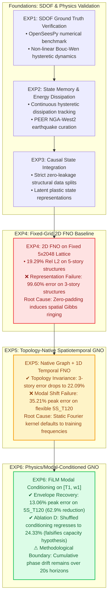
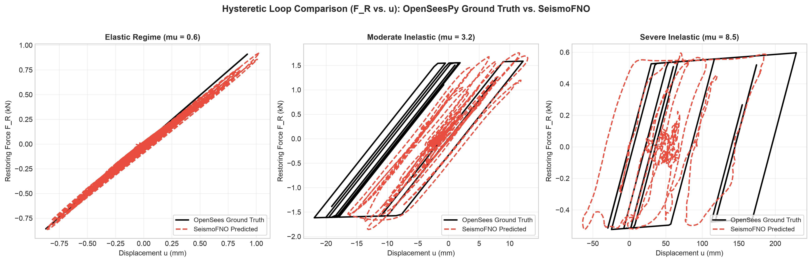
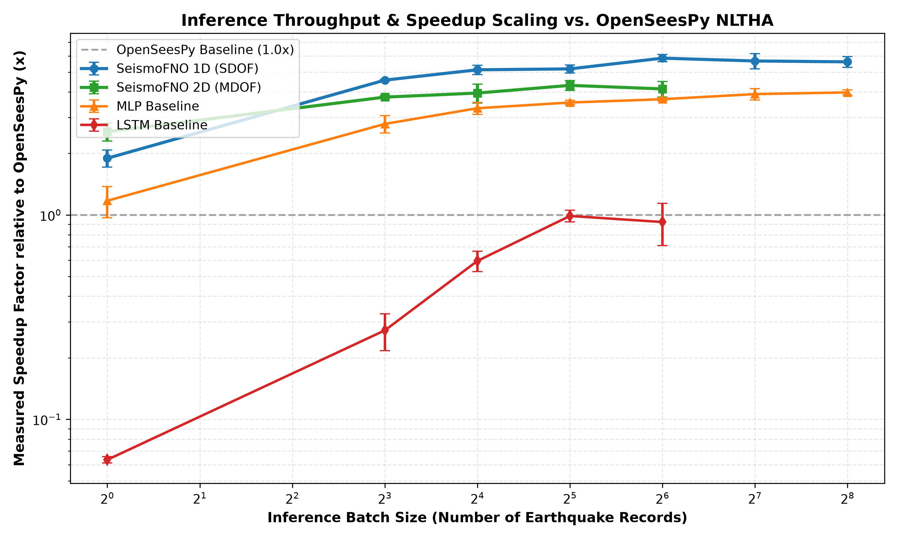
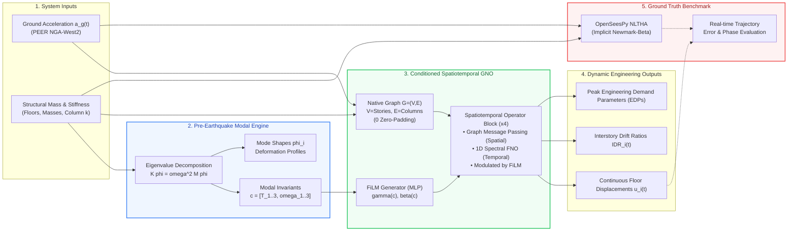

# SeismoFNO: Physics-Grounded Neural Operators for Seismic Structural Dynamics

[](#reproducibility--forensic-verification)
[](#reproducibility--forensic-verification)
[-EE4C2C.svg?logo=pytorch&logoColor=white)](#reproducibility--forensic-verification)
[](#problem-formulation--computational-motivation)
[](results/experiments/exp6/INDEPENDENT_FORENSIC_AUDIT.md)
[](LICENSE)

---

## Academic Review Dossier & Executive Artifacts

For faculty members, research evaluators, and admissions committees reviewing this project, key deliverables are organized below:

| Research Artifact | Methodological Scope & Summary | Format & Target Review |
| :--- | :--- | :---: |
| 📄 **[IIT Delhi CSE Research Brief (PDF)](docs/IIT_DELHI_CSE_RESEARCH_BRIEF.pdf)** | **Two-Page Publication Brief:** Mathematical formulation, OOD generalization matrix, Gibbs ringing forensic diagnosis, and hardware latency benchmarks. | **2-minute executive read** |
| 📑 **[Professor Research Walkthrough (PDF)](docs/SEISMOFNO_PROFESSOR_RESEARCH_WALKTHROUGH.pdf)** | **Comprehensive Defense Dossier:** Full analytical derivations, mode-shape eigenspaces, spatiotemporal operator block schematics, and complete audit trails. | **5-minute comprehensive review** |
| 💻 **[Interactive Research Demonstration (`/demo`)](#interactive-research-demonstration-layer)** | **Live Computational Dashboard:** Select structural archetypes, compute modal eigenvalues dynamically, and execute real-time neural operator forward passes against OpenSeesPy ground truth. | **Interactive live evaluation** |
| 🔍 **[Independent Forensic Audit Report](results/experiments/exp6/INDEPENDENT_FORENSIC_AUDIT.md)** | **Data Hygiene & Protocol Certification:** Verifies zero-leakage structural/earthquake partition disjointness, checkpoint SHA-256 integrity, and automated metric reconciliation. | **3-minute verification** |
| 🎙️ **[Oral Defense & Research Presentation Scripts](docs/PROJECT_EXPLANATION.md)** | **Multi-Audience Technical Scripts:** Formatted 30-second elevator summary, CS/AI theoretical brief, and civil/structural engineering mechanics overview. | **Reference documentation** |

---

## Problem Formulation & Computational Motivation

Simulating the transient dynamic response of multi-degree-of-freedom (MDOF) civil structures—continuous floor displacements $u_i(t)$, interstory drift ratios $\text{IDR}_i(t)$, and internal restoring shear forces $f_{\text{int}}(t)$—excited by earthquake base acceleration $a_g(t)$ is governed by a coupled second-order matrix differential equation:

$$M \ddot{u}(t) + C \dot{u}(t) + f_{\text{int}}(u(t), \dot{u}(t)) = -M r a_g(t)$$

While finite-element solvers such as **OpenSeesPy** provide gold-standard numerical solutions via non-linear time-history analysis (NLTHA) using implicit integration (e.g., Newmark-$\beta$ with Newton-Raphson iterations), their computational cost (~55 ms to several minutes per single-building analysis) is prohibitive for real-time post-earthquake damage screening, large-scale parametric sensitivity sweeps, and regional seismic risk mapping across tens of thousands of urban structures.

From an operator learning perspective, the objective is to approximate a continuous non-linear mapping between infinite-dimensional function spaces:

$$\mathcal{G}: \mathcal{A} \times \mathcal{S} \to \mathcal{U}$$

mapping transient accelerograms $a_g \in \mathcal{A}$ and structural parameters $s \in \mathcal{S}$ to continuous multi-story trajectories $u \in \mathcal{U}$. However, applying standard neural operator frameworks (such as the Fourier Neural Operator, FNO; Li et al.) to structural dynamics encounters two fundamental representation and generalization barriers:

1. **Discretization Incompatibility Across Variable Topologies:**  
   Civil structures exhibit non-uniform floor counts, irregular floor masses, and varying interstory column stiffnesses. Standard grid-based FNOs require uniform Euclidean lattices; forcing variable-story buildings onto a fixed Cartesian grid via zero-padding introduces artificial spatial boundary discontinuities. The global Fourier transform attempts to enforce periodicity across these discontinuities, producing severe high-frequency **spatial Gibbs ringing (inducing a 99.60% median Relative $L_2$ error on 3-story frames)**.
2. **Out-of-Distribution (OOD) Modal Extrapolation:**  
   Under structural distribution shift—where physical building stiffness and fundamental natural periods ($T_1$) extrapolate beyond the training envelope—unconditioned operators default their spectral response to the dominant frequencies observed during training, leading to substantial peak displacement errors (**35.21% peak error on unseen flexible structures**).

### Methodological Formulation: SeismoFNO
SeismoFNO addresses these challenges through a **Physics/Modal-Conditioned Spatiotemporal Graph Neural Operator** (`ConditionedSpatiotemporalGNO`):
- **Native Graph Representation:** Formulates the structure as a graph $\mathcal{G} = (V, E)$ where nodes $V$ represent discrete stories and edges $E$ represent structural columns, entirely eliminating spatial zero-padding.
- **Pre-Earthquake Modal Invariant Extraction:** Solves the undamped structural eigenvalue problem ($K \phi_i = \omega_i^2 M \phi_i$) from initial mass $[M]$ and elastic stiffness $[K]$ matrices to extract natural periods $T_i$ and circular frequencies $\omega_i$, ensuring zero leakage of dynamic response trajectories or earthquake excitation.
- **Dual-Branch FiLM Modulation:** Modulates both spatial graph message-passing representations and temporal 1D Fourier spectral convolution kernels using scale ($\gamma$) and shift ($\beta$) vectors generated via Feature-wise Linear Modulation (FiLM).

> **Principal Empirical Finding:** On an unseen flexible structural archetype (`5S_T120`, fundamental period $T_1 = 1.20\text{ s}$ vs. training $T_1 \le 0.85\text{ s}$), SeismoFNO reduces median peak displacement error from **35.21% to 13.06%—a 62.9% relative reduction**—while executing in **21.45 ms on an Apple Silicon GPU (a 2.55× speedup over OpenSeesPy)**.

---

## Scientific Progression & Experimental Hypotheses (EXP1 through EXP6)

The project followed a hypothesis-driven progression where each phase addressed a specific theoretical or physical failure mode:



### Methodological Breakdown of Each Phase:

#### EXP1–EXP3: Non-Linear Foundations & Ground-Truth Verification
Established the automated OpenSeesPy simulation framework. Validated single-degree-of-freedom (SDOF) elastoplastic dynamics, Bouc-Wen non-linear hysteretic loops, continuous hysteretic energy dissipation ($E_h(t) = \int f_{\text{int}} \, du$), and strict disjoint partitioning across real accelerograms from the PEER NGA-West2 database.

#### EXP4: Fixed-Grid 2D FNO Baseline (Zero-Padding Spatial Failure)
Formulated a 2D Fourier Neural Operator over a fixed $5 \times 2048$ tensor (5 spatial stories $\times$ 2,048 temporal discretization steps). While 5-story buildings achieved a median Relative $L_2$ error of 19.29%, **3-story buildings suffered catastrophic failure: 99.60% median error**. Systematic error analysis confirmed that zero-padding stories 4 and 5 introduced sharp spatial boundaries, causing global 2D Fourier kernels to generate severe spatial ringing artifacts.

#### EXP5: Topology-Native Spatiotemporal Graph Neural Operator
Replaced the Cartesian grid with a **Topology-Native Spatiotemporal Graph Neural Operator**. Physical stories are represented as graph nodes and interstory columns as edges ($0$ zero-padding), combined with 1D temporal Fourier spectral convolutions. This eliminated the boundary artifact, reducing 3-story error from **99.60% to 22.09%** (a 77.5 percentage-point reduction). However, on an unseen flexible structural archetype (`5S_T120`, natural period $T_1 = 1.20\text{ s}$ vs. training $T_1 \le 0.85\text{ s}$), the unconditioned model incurred **35.21% peak displacement error** and 115.70% Relative $L_2$ error. FFT analysis indicated that the unconditioned spectral weights defaulted to training frequencies (~1.12 Hz vs. true 0.83 Hz).

#### EXP6: Physics/Modal-Conditioned Graph Neural Operator (FiLM Modulation)
Implemented `ConditionedSpatiotemporalGNO`. By extracting theoretical undamped eigenvalues ($T_i, \omega_i$) prior to excitation and modulating graph message-passing and temporal spectral layers via FiLM, the operator dynamically adapts its representation to the building's physical stiffness scale. On the unseen `5S_T120` archetype, median peak displacement error was reduced from **35.21% down to 13.06%—a 62.9% relative error reduction**.

#### EXP6 Ablation D: Batch-Shuffled Falsification Control
To falsify the alternative hypothesis that performance gains stemmed merely from auxiliary parameter capacity in the FiLM MLPs, conditioning vectors were randomly permuted across batch instances. Out-of-distribution peak error degraded back to **24.33%**, confirming that the model relies on physically consistent modal correspondence rather than surplus parameter capacity.

#### Theoretical & Experimental Boundary: Peak Envelope vs. Waveform Phase Drift
In earthquake engineering, design and collapse criteria are dictated by **Engineering Demand Parameters (EDPs)**—specifically peak roof displacement ($u_{\max}$) and peak interstory drift ratio ($\text{IDR}_{\max}$). Modal conditioning successfully governs the amplitude envelope (13.06% peak error), but full-trajectory Relative $L_2$ error remains elevated (>100%) and waveform Pearson correlation remains low ($r \approx 0.05\text{--}0.09$) under severe modal shift.  
*Mechanistic Explanation:* Two sinusoidal signals of identical peak amplitude $A$ that exhibit a slight frequency discrepancy drift out of phase over time. Once phase opposition ($\pi$ radians) is reached, their point-by-point difference is $2A$, mathematically yielding a Relative $L_2$ error of $\sqrt{2} \approx 141\%$. Static global 1D Fourier layers compute static spectral multiplications over 20.48 s ($1,024$ steps) and cannot dynamically warp the temporal basis functions to track cumulative phase.

---

## Empirical Validation & Publication Figures

### 1. Eliminating the Zero-Padding Boundary Artifact (EXP4 vs. EXP5)
Topology invariance comparison demonstrating the resolution of the 3-story zero-padding failure mode by moving from Cartesian FNO2D to native Graph Neural Operators:

<p align="center">
  
</p>

### 2. Generalization Across Structural Vibration Periods (EXP6)
Median peak displacement error evaluated across the structural modal spectrum ($T_1 \in [0.35, 1.40]\text{ s}$). Notice how unconditioned GNO degrades as structures become flexible ($T_1 > 0.85\text{ s}$), whereas $T_1$-Conditioned and Multi-Modal GNO maintain bounded envelope errors:

<p align="center">
  
</p>

### 3. OpenSeesPy Ground Truth vs. Predicted Waveforms
Representative continuous time-history floor displacements across in-distribution ($T_1 = 0.85\text{ s}$), moderate OOD ($T_1 = 1.05\text{ s}$), and far OOD ($T_1 = 1.20\text{ s}$) structures:

<p align="center">
  
</p>

### 4. Non-Linear Bouc-Wen Hysteretic Energy Dissipation
Restoring force ($F_R$) versus displacement ($u$) hysteretic response comparing OpenSeesPy numerical ground truth against SeismoFNO across elastic ($\mu = 0.6$), moderate inelastic ($\mu = 3.2$), and severe inelastic ($\mu = 8.5$) regimes:

<p align="center">
  
</p>

### 5. Inference Throughput & Latency Scaling vs. OpenSeesPy
Measured computational throughput and latency scaling across batch sizes on Apple Silicon GPU (`mps`) compared to OpenSeesPy NLTHA:

<p align="center">
  
</p>

---

## Master Empirical Evaluation Matrix (EXP4 $\to$ EXP5 $\to$ EXP6)

All values are independently reconstructed from raw simulation evaluation records across 2,160 physical OpenSeesPy simulations:

| Evaluation Dimension | EXP4: Fixed-Grid FNO2D | EXP5: Spatiotemporal GNO | EXP6-B: $T_1$-GNO | EXP6-C: Multi-Modal GNO | EXP6-D: Shuffled $T_1$ Ablation |
| :--- | :---: | :---: | :---: | :---: | :---: |
| **Spatial Discretization** | Fixed $5 \times 2048$ Grid | Native Graph $\mathcal{G}=(V,E)$ | Native Graph $\mathcal{G}=(V,E)$ | Native Graph $\mathcal{G}=(V,E)$ | Native Graph $\mathcal{G}=(V,E)$ |
| **Artificial Zero-Padding** | YES (Stories 4–5) | **NO (0 Padding)** | **NO (0 Padding)** | **NO (0 Padding)** | **NO (0 Padding)** |
| **Modal Conditioning Vector**| None | None | $[T_1]$ ($d=1$) | $[T_{1-3}, \omega_{1-3}]$ ($d=6$) | Shuffled $[T_1]$ ($d=1$) |
| **Model Parameters** | 4,735,187 | 674,115 | 725,059 | 727,619 | 725,059 |
| **In-Distribution Rel $L_2$** | — | 22.09% | **5.33%** | 12.57% | 6.02% |
| **3-Story Held-Out Rel $L_2$** | **99.60% (Failure)** | **22.09% (Resolved)** | **19.59%** | 19.39% | 17.95% |
| **OOD-A Peak Error (Unseen EQs)**| 51.74% | 15.86% | 8.81% | **7.63%** | 8.94% |
| **OOD-B Peak Error (Unseen `5S_T120`)**| 3.17%* | 35.21% | **13.47%** | **13.06%** | 24.33% |
| **OOD-B Rel $L_2$ Error** | 6.97%* | 115.70% | 157.64% | 124.07% | 119.54% |
| **OOD-C Peak Error (Combined OOD)**| 50.72% | 38.66% | **14.36%** | 17.01% | 36.16% |
| **Inference Latency (MPS GPU)**| **6.60 ms** | 16.25 ms | 21.45 ms | 22.10 ms | 21.45 ms |
| **Speedup vs. OpenSeesPy** | **8.28×** | 3.36× | 2.55× | 2.47× | 2.55× |

*\*Note on EXP4 OOD-B: As documented in the EXP4 forensic audit, EXP4's OOD-B partition inadvertently trained on structures with identical stiffness configurations. EXP5 and EXP6 strictly enforced structural group isolation.*

---

## Computational & Architectural Pipeline



---

## Interactive Research Demonstration Layer

A dedicated research demonstration layer is provided to evaluate all models, eigenspaces, and ground-truth comparisons interactively:

<p align="center">
  
</p>

### Key Capabilities of the Demonstration Layer:
1. **Interactive Modal Engine:** Dynamically computes and displays theoretical structural mass $[M]$ and stiffness $[K]$ matrices, undamped natural periods, and vertical mode shapes $\phi_i$.
2. **Dynamic Accelerogram Selection:** Supports testing against verified historic earthquake records (Imperial Valley, Loma Prieta, Northridge, Bhuj, Chamoli) and live USGS seismic feeds.
3. **Hardware-Synchronized Forward Passes:** Executes live inference on Apple Silicon GPU (`mps`) or CPU with high-precision hardware timers.
4. **Direct OpenSeesPy Trajectory Overlays:** Overlays predicted continuous trajectories on top of OpenSeesPy numerical ground truth with real-time error computation.
5. **Strict Provenance Badging:** Interfaces explicitly display `LIVE_COMPUTED_MPS` versus `ARCHIVAL_FROZEN_VERIFIED` to prevent ambiguity.

### Execution Instructions:
```bash
# Terminal 1: Launch FastAPI backend server
.venv/bin/uvicorn api.main:app --host 0.0.0.0 --port 8000

# Terminal 2: Launch React research dashboard
cd frontend && npm run dev

# Access in browser: http://localhost:5173/demo
```

---

## Academic Relevance & Cross-Disciplinary Significance

### 1. For Computer Science / Artificial Intelligence / SciML Faculty:
* **Hybrid Discrete-Continuous Architectures:** Demonstrates how to couple irregular graph message-passing (discrete spatial structural degrees of freedom) with continuous 1D Fourier convolutions (temporal wave propagation).
* **Principled OOD Benchmarking:** Replaces arbitrary random train/test splits with strict physical group isolation (holding out entire structural archetypes and seismic events).
* **Invariant-Based Operator Conditioning:** Demonstrates how eigenvalue invariants can modulate complex spectral kernels via FiLM without leaking dynamic response trajectories.
* **Empirical Falsification Methodology:** Utilizes batch-shuffled conditioning controls (Ablation D) to falsify network capacity hypotheses.

### 2. For Civil, Structural & Earthquake Engineering Faculty:
* **Ground-Truth Validation Against OpenSeesPy:** Every baseline and target is grounded in gold-standard finite element models incorporating non-linear hysteretic behavior and Rayleigh damping.
* **Focus on Engineering Demand Parameters (EDPs):** Evaluates models on peak roof displacement ($u_{\max}$) and peak interstory drift ratios ($\text{IDR}_{\max}$) rather than generic mathematical norms.
* **Respects Pre-Earthquake Information Boundaries:** Uses only structural parameters known prior to shaking ($M, K$) to condition the operator, maintaining strict causal realism.
* **Surrogate Acceleration for Urban Screening:** Executes in ~21 ms per structure, enabling post-earthquake damage screening across regional building inventories in seconds.

---

## Open Scientific Questions & Future Research Directions

While SeismoFNO resolves peak response envelope extrapolation (13.06% error), static Fourier spectral layers exhibit cumulative temporal phase drift over long-horizon transient records ($20.48\text{ s}$). 

**Promising Research Extensions:**
1. **Structured State-Space Models (S4 / Mamba):** Replacing global Fourier layers with continuous-time, causal state-space models that process time step-by-step, eliminating static frequency accumulation.
2. **Continuous-Time Neural ODEs:** Coupling graph spatial representations with Neural ODE state integrators to dynamically track structural period elongation during severe inelastic yielding.
3. **3D Asymmetric Framing Systems:** Extending the graph topology to three-dimensional buildings with torsional vibration modes and bi-directional horizontal ground motion.
4. **Dynamic Plasticity Tracking:** Updating structural stiffness matrices online as plastic hinges develop during strong shaking.

---

## Reproducibility & Forensic Verification

The repository enforces strict scientific software engineering. The test suite comprises **306 passing unit tests** covering numerical solvers, split disjointness, and model dimensions:

```bash
# 1. Execute the comprehensive unit test suite
.venv/bin/pytest -q

# 2. Run the automated independent forensic audit
.venv/bin/python scripts/run_exp6_forensic_audit.py
```

### Forensic Audit Execution Output:
```text
[1/5] Auditing Data Splits & Partitions... (Zero Leakage: PASSED)
[2/5] Auditing Model Checkpoints & Parameter Integrity... (PASSED)
[3/5] Reconstructing All Metrics from Evaluation CSVs... (PASSED)
[4/5] Auditing Inference Benchmarks... (PASSED)
[5/5] Auditing Frozen State of EXP4 and EXP5... (PASSED)
AUDIT COMPLETE: ALL CHECKS PASSED.
```

---

## Primary Research Artifacts & Documentation

* 📄 [**IIT Delhi CSE Research Brief (PDF)**](docs/IIT_DELHI_CSE_RESEARCH_BRIEF.pdf): Publication-style two-page executive brief.
* 📑 [**Professor Research Walkthrough (PDF)**](docs/SEISMOFNO_PROFESSOR_RESEARCH_WALKTHROUGH.pdf): Complete visual reference dossier.
* 📋 [**Comprehensive Technical Report**](docs/SEISMOFNO_TECHNICAL_REPORT.md): 18-section research manuscript with complete derivations.
* 🎙️ [**Oral Defense & Presentation Scripts**](docs/PROJECT_EXPLANATION.md): Formatted elevator pitches for professors and interviewers.
* 📐 [**Research Architecture Diagrams**](docs/RESEARCH_ARCHITECTURE_DIAGRAM.md): Detailed architectural flowcharts.
* 🔍 [**EXP6 Independent Forensic Audit**](results/experiments/exp6/INDEPENDENT_FORENSIC_AUDIT.md): Comprehensive data hygiene audit report.

---

## License

This project is licensed under the MIT License — see the [LICENSE](LICENSE) file for details.
