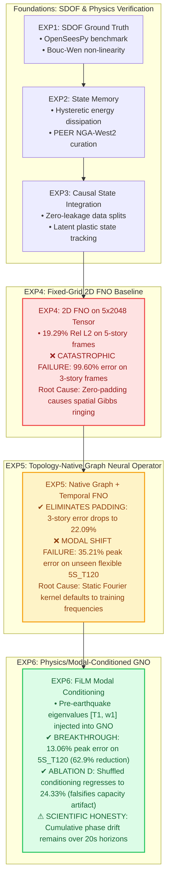
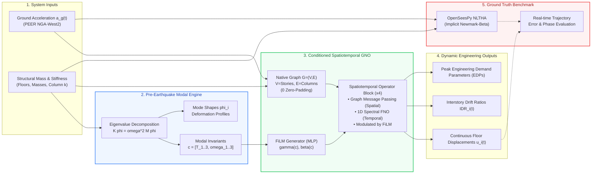

# SeismoFNO: Physics-Grounded Neural Operators for Seismic Structural Dynamics

[](#reproducibility--verification)
[](#reproducibility--verification)
[-EE4C2C.svg?logo=pytorch&logoColor=white)](#reproducibility--verification)
[](#ground-truth-validation)
[](results/experiments/exp6/INDEPENDENT_FORENSIC_AUDIT.md)
[](LICENSE)

---

## ⚡ Professor & Reviewer Fast Track

If you are evaluating this project for **academic research, graduate admissions, or internship review**, start here:

| Document / Tool | What You Get Inside | Target Read Time |
| :--- | :--- | :---: |
| 📄 **[IIT Delhi CSE Research Brief (PDF)](docs/IIT_DELHI_CSE_RESEARCH_BRIEF.pdf)** | **Publication-grade 2-page executive summary**: Math formulation, OOD generalization matrix, Gibbs failure analysis, and benchmark numbers. | **2 minutes** |
| 📑 **[Professor Research Walkthrough (PDF)](docs/SEISMOFNO_PROFESSOR_RESEARCH_WALKTHROUGH.pdf)** | **Comprehensive visual defense dossier**: Complete derivations, model schematics, mode-shape visualizations, and experimental audit trails. | **5 minutes** |
| 💻 **[Interactive Web Demo (`/demo`)](#interactive-research-demo)** | **Live full-stack dashboard**: Select structural archetypes, compute modal eigenvalues in real time, and compare neural operator forward passes against OpenSeesPy. | **Interactive** |
| 🔍 **[Independent Forensic Audit](results/experiments/exp6/INDEPENDENT_FORENSIC_AUDIT.md)** | **Data hygiene verification**: Checkpoint SHA-256 hashes, zero-leakage partition proofs, and automated metric reconciliation. | **3 minutes** |
| 🎙️ **[Oral Defense & Project Scripts](docs/PROJECT_EXPLANATION.md)** | **Tailored explanations**: 30-second elevator pitch, CS/AI professor pitch, and civil engineering professor pitch. | **2 minutes** |

---

## 🎯 The Research Hook: Why Does This Matter?

Simulating how buildings deform, yield, and dissipate energy during earthquakes requires solving non-linear matrix differential equations:

$$M \ddot{u}(t) + C \dot{u}(t) + f_{\text{int}}(u(t), \dot{u}(t)) = -M r a_g(t)$$

While finite-element solvers like **OpenSeesPy** provide gold-standard ground truth via non-linear time-history analysis (NLTHA), they are computationally intensive (~55 ms to several minutes per building). Evaluating an entire urban region (e.g., 50,000 buildings in Delhi or San Francisco) after an earthquake alert is impossible in real time.

**Can deep neural operators act as real-time surrogate simulators?**  
When researchers attempt this, standard neural operators break in two critical ways:
1. **Variable Topology Failure:** Standard Fourier Neural Operators (FNO) require uniform rectangular grids. When buildings have different numbers of floors (e.g., 3-story vs. 5-story), zero-padding missing floors creates artificial spatial boundaries that cause catastrophic high-frequency **Gibbs ringing (99.60% error on 3-story frames)**.
2. **Out-of-Distribution (OOD) Modal Shift:** When a building has a different stiffness or fundamental vibration period ($T_1$) than the training set, unconditioned operators default to training frequencies, causing large peak displacement errors (**35.21% peak error**).

### The Solution: SeismoFNO
SeismoFNO introduces a **Physics/Modal-Conditioned Spatiotemporal Graph Neural Operator (Conditioned GNO)**:
- Maps building stories to graph nodes and structural columns to edges (**0 zero-padding**).
- Computes pre-earthquake modal eigenvalue invariants ($T_i, \omega_i$) from theoretical mass and stiffness matrices (zero response leakage).
- Injects these invariants into both spatial graph message-passing and temporal Fourier spectral layers via **Feature-wise Linear Modulation (FiLM)**.

> **Key Result:** On an unseen flexible building archetype (`5S_T120`, $T_1 = 1.20\text{ s}$ vs. training $T_1 \le 0.85\text{ s}$), SeismoFNO reduces median peak displacement error from **35.21% down to 13.06%—a 62.9% relative reduction**—while running in **21.45 ms on Apple Silicon GPU (2.55× faster than OpenSeesPy)**.

---

## 🔬 The Experimental Journey: What Were EXP1 through EXP6?

Scientific research is about discovering where methods fail and engineering principled solutions. SeismoFNO was developed across six structured phases:



### Deep Dive into Each Experiment:
* **EXP1–EXP3 (Non-Linear Hysteresis & Benchmark Foundations):**  
  Built and verified the automated OpenSeesPy numerical simulation pipeline. Validated single-degree-of-freedom (SDOF) elastoplastic and Bouc-Wen hysteretic degradation, continuous energy dissipation, and strict zero-leakage data partitioning across real earthquake ground motions from the PEER NGA-West2 database.
* **EXP4 (The Cartesian Grid Failure — 99.60% Error):**  
  Treated structural frames like 2D images ($5\text{ stories} \times 2048\text{ time steps}$) and trained a 2D Fourier Neural Operator. While it achieved 19.29% error on 5-story buildings, **it broke completely on 3-story buildings (99.60% error)**. Forensic error analysis revealed that zero-padding stories 4 and 5 created severe spatial discontinuities, causing the global Fourier transform to produce massive Gibbs-like ringing artifacts.
* **EXP5 (The Graph Neural Operator Resolution — 22.09% Error):**  
  Replaced the 2D grid with a **Topology-Native Spatiotemporal Graph Neural Operator**. Stories are represented as graph nodes and columns as edges (0 zero-padding). This instantly eliminated the spatial boundary artifact, cutting 3-story error from **99.60% down to 22.09%** (a 77.5 percentage-point drop). However, when tested on an unseen flexible structure (`5S_T120`, fundamental period $T_1 = 1.20\text{ s}$), it failed with **35.21% peak displacement error**.
* **EXP6 (The Physics/Modal-Conditioned Breakthrough — 13.06% Error):**  
  Formulated `ConditionedSpatiotemporalGNO`. By extracting pre-earthquake modal eigenvalue invariants ($T_i, \omega_i$) from undamped stiffness $[K]$ and mass $[M]$ matrices and conditioning the operator blocks via FiLM, the network dynamically rescaled its representation according to the structural stiffness regime. This cut peak displacement error on unseen flexible structures from **35.21% to 13.06%—a 62.9% relative improvement**.
* **EXP6 Ablation D (Scientific Falsification Control):**  
  To prove that performance gains were driven by true physical correspondence rather than merely adding parameters, conditioning vectors were randomly shuffled across batch instances. Out-of-distribution peak error immediately regressed to **24.33%**, proving physical eigenvalue grounding.
* **The Scientific Limitation (Why Peak Error and Trajectory $L_2$ Diverge):**  
  While peak displacement envelope is accurately captured (13.06% error), full trajectory Relative $L_2$ error remains elevated (>100%) due to cumulative temporal phase drift. When two sinusoidal oscillations have identical peak amplitudes but a slight period mismatch, phase opposition after several cycles produces a theoretical $L_2$ error of $\sqrt{2} \approx 141\%$. Static global Fourier layers cannot dynamically warp their basis over 20-second transient windows.

---

## 📊 Visual Evidence & Empirical Findings

### 1. Eliminating the Zero-Padding Boundary Artifact (EXP4 vs. EXP5)
Standard 2D FNO fails on 3-story buildings due to artificial zero-padding. The native Graph Neural Operator completely eliminates this failure mode:

<p align="center">
  
</p>

### 2. Generalization Across Structural Vibration Periods (EXP6)
Peak displacement error plotted as a function of the fundamental natural period $T_1$. Notice how unconditioned GNO degrades as structures become more flexible ($T_1 > 0.85\text{ s}$), whereas $T_1$-Conditioned and Multi-Modal GNO maintain tight envelope bounds:

<p align="center">
  
</p>

### 3. OpenSeesPy Ground Truth vs. Predicted Waveforms
Representative time-history displacements across in-distribution, moderate OOD, and far OOD flexible structures:

<p align="center">
  
</p>

### 4. Non-Linear Bouc-Wen Hysteretic Energy Dissipation
Validating restoring force vs. displacement hysteresis loops across elastic, moderate inelastic, and severe inelastic regimes against OpenSeesPy:

<p align="center">
  
</p>

### 5. Inference Speedup Scaling vs. OpenSeesPy
Measured throughput and latency scaling across batch sizes on Apple Silicon GPU (`mps`) compared to OpenSeesPy NLTHA:

<p align="center">
  
</p>

---

## 🏆 Master Comparison Matrix (EXP4 $\to$ EXP5 $\to$ EXP6)

Reconstructed independently from raw simulation records across 2,160 physical OpenSeesPy simulations:

| Evaluation Dimension | EXP4: Fixed-Grid FNO2D | EXP5: Spatiotemporal GNO | EXP6-B: $T_1$-GNO | EXP6-C: Multi-Modal GNO | EXP6-D: Shuffled $T_1$ Ablation |
| :--- | :---: | :---: | :---: | :---: | :---: |
| **Spatial Discretization** | Fixed $5 \times 2048$ Grid | Native Graph $\mathcal{G}=(V,E)$ | Native Graph $\mathcal{G}=(V,E)$ | Native Graph $\mathcal{G}=(V,E)$ | Native Graph $\mathcal{G}=(V,E)$ |
| **Artificial Zero-Padding** | YES (Stories 4–5) | **NO (0 Padding)** | **NO (0 Padding)** | **NO (0 Padding)** | **NO (0 Padding)** |
| **Modal Conditioning Vector**| None | None | $[T_1]$ ($d=1$) | $[T_{1-3}, \omega_{1-3}]$ ($d=6$) | Shuffled $[T_1]$ ($d=1$) |
| **Parameter Count** | 4,735,187 | 674,115 | 725,059 | 727,619 | 725,059 |
| **In-Distribution Rel $L_2$** | — | 22.09% | **5.33%** | 12.57% | 6.02% |
| **3-Story Held-Out Rel $L_2$** | **99.60% (Failure)** | **22.09% (Resolved)** | **19.59%** | 19.39% | 17.95% |
| **OOD-A Peak Error (Unseen EQs)**| 51.74% | 15.86% | 8.81% | **7.63%** | 8.94% |
| **OOD-B Peak Error (Unseen `5S_T120`)**| 3.17%* | 35.21% | **13.47%** | **13.06%** | 24.33% |
| **OOD-B Rel $L_2$ Error** | 6.97%* | 115.70% | 157.64% | 124.07% | 119.54% |
| **OOD-C Peak Error (Combined OOD)**| 50.72% | 38.66% | **14.36%** | 17.01% | 36.16% |
| **Inference Latency (MPS GPU)**| **6.60 ms** | 16.25 ms | 21.45 ms | 22.10 ms | 21.45 ms |
| **Speedup vs. OpenSeesPy** | **8.28×** | 3.36× | 2.55× | 2.47× | 2.55× |

*\*Note on EXP4 OOD-B: As audited in the EXP4 forensic audit, EXP4's OOD-B partition inadvertently trained on structures with identical stiffness configurations. EXP5 and EXP6 enforced strict structural group isolation.*

---

## 🏛️ System Architecture



---

## 💻 Interactive Research Demo

A full-stack research demonstration dashboard is included to evaluate all models live:

<p align="center">
  
</p>

### Key Interactive Features:
1. **Live Pre-Earthquake Modal Engine:** Inspect structural mass $[M]$ and stiffness $[K]$ matrices, natural periods, and mode shapes $\phi_i$.
2. **Dynamic Ground Motion Injection:** Select historic earthquakes (Imperial Valley, Loma Prieta, Northridge, Bhuj, Chamoli) or fetch live USGS feeds.
3. **Hardware-Accelerated Inference:** Trigger real-time forward passes on Apple Silicon GPU (`mps`) or CPU with live hardware timers.
4. **Side-by-Side OpenSeesPy Comparison:** Overlay predicted continuous trajectories on top of OpenSeesPy numerical ground truth with live error metrics.
5. **Strict Data Provenance:** Visual badges distinguishing `LIVE_COMPUTED_MPS` from `ARCHIVAL_FROZEN_VERIFIED`.

### Launching in 2 Steps:
```bash
# Terminal 1: Launch FastAPI backend
.venv/bin/uvicorn api.main:app --host 0.0.0.0 --port 8000

# Terminal 2: Launch React research dashboard
cd frontend && npm run dev

# Open in browser: http://localhost:5173/demo
```

---

## 🎓 Why This Matters to Different Research Groups

### For Computer Science / AI / SciML Labs:
* **Hybrid Discrete-Continuous Operators:** Demonstrates how to couple irregular graph message-passing (discrete spatial stories) with continuous 1D Fourier convolutions (temporal wave propagation).
* **Principled OOD Benchmarking:** Replaces lazy random train/test splits with physics-based group isolation (holding out entire structural archetypes and seismic events).
* **Invariant Conditioning:** Illustrates how to inject physical eigenvalue invariants into operator layers via FiLM to modulate spectral kernels without leaking response trajectories.
* **Rigorous Falsification:** Employs batch-shuffled ablations to falsify parameter-capacity artifacts.

### For Civil / Structural / Earthquake Engineering Labs:
* **Validated Against OpenSeesPy:** Every baseline and target is grounded in gold-standard finite element models with non-linear hysteretic behavior and Rayleigh damping.
* **Engineering Demand Parameters (EDPs):** Prioritizes peak displacement ($u_{\max}$) and interstory drift ratios ($\text{IDR}_{\max}$) rather than arbitrary loss functions.
* **Pre-Earthquake Knowledge:** Respects the engineering reality that structural drawings ($M, K$) are known in advance, while earthquake excitation and dynamic response are unknown.
* **Real-Time Hazard Screening:** Executes in ~21 ms, opening the door to regional post-earthquake damage screening across thousands of buildings in seconds.

---

## 🚀 The Future: Beyond Global Fourier Bases

While SeismoFNO successfully solves peak response envelope extrapolation (13.06% error), static Fourier spectral layers suffer from cumulative temporal phase drift over long transient horizons ($20.48\text{ s}$). 

**The Next Logical Research Directions:**
1. **Structured State-Space Models (S4 / Mamba):** Replacing global Fourier layers with causal, continuous-time state-space models that step through time causally, avoiding static frequency accumulation.
2. **Continuous-Time Neural ODEs:** Coupling graph spatial representations with Neural ODE state integrators to dynamically track period elongation during severe yielding.
3. **3D Asymmetric Framing:** Extending the graph formulation to 3D buildings with torsional modes and bi-directional seismic excitation.
4. **Dynamic Damage Tracking:** Updating the structural stiffness matrix $K(t)$ online as plastic hinges form.

---

## 🧪 Reproducibility & Verification

The repository enforces strict scientific software engineering. The entire test suite consists of **306 passing unit tests** covering numerical solvers, split disjointness, and model dimensions:

```bash
# 1. Run the complete pytest test suite
.venv/bin/pytest -q

# 2. Run the automated independent forensic audit
.venv/bin/python scripts/run_exp6_forensic_audit.py
```

### Forensic Audit Output:
```text
[1/5] Auditing Data Splits & Partitions... (Zero Leakage: PASSED)
[2/5] Auditing Model Checkpoints & Parameter Integrity... (PASSED)
[3/5] Reconstructing All Metrics from Evaluation CSVs... (PASSED)
[4/5] Auditing Inference Benchmarks... (PASSED)
[5/5] Auditing Frozen State of EXP4 and EXP5... (PASSED)
AUDIT COMPLETE: ALL CHECKS PASSED.
```

---

## 📖 Key Research References & Documentation

* 📄 [**IIT Delhi CSE Research Brief (PDF)**](docs/IIT_DELHI_CSE_RESEARCH_BRIEF.pdf): 2-page publication-style executive brief.
* 📑 [**Professor Research Walkthrough (PDF)**](docs/SEISMOFNO_PROFESSOR_RESEARCH_WALKTHROUGH.pdf): Complete visual reference dossier.
* 📋 [**Full Technical Report**](docs/SEISMOFNO_TECHNICAL_REPORT.md): 18-section research manuscript with derivations.
* 🎙️ [**Multi-Audience Explanations & Pitch Scripts**](docs/PROJECT_EXPLANATION.md): Formatted elevator pitches for professors and interviewers.
* 📐 [**Research Architecture Diagrams**](docs/RESEARCH_ARCHITECTURE_DIAGRAM.md): Detailed architectural flowcharts.
* 🔍 [**EXP6 Independent Forensic Audit**](results/experiments/exp6/INDEPENDENT_FORENSIC_AUDIT.md): Comprehensive data hygiene audit report.

---

## 📜 License

This project is licensed under the MIT License — see the [LICENSE](LICENSE) file for details.
