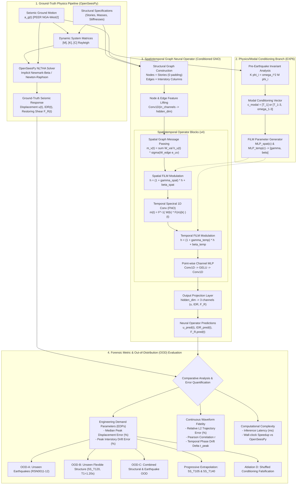

# SeismoFNO — Research Pipeline & Architecture Diagram

This document illustrates the complete computational architecture and experimental workflow of SeismoFNO across ground-truth numerical simulation, graph representation learning, physics-informed modal conditioning (EXP6), and multi-metric out-of-distribution evaluation.

---

## 1. High-Level Scientific Pipeline (Mermaid)



---

## 2. Textual Pipeline Flowchart

```
=================================================================================================
                                  SEISMOFNO PIPELINE ARCHITECTURE
=================================================================================================

 [ GROUND MOTION ]              [ STRUCTURAL PARAMS ]
  a_g(t) (PEER NGA)              Stories, Masses, Stiffnesses
        │                                      │
        ▼                                      ▼
 ┌─────────────────────────────────────────────────────────────┐
 │                PHYSICAL EQUATIONS OF MOTION                 │
 │            M u''(t) + C u'(t) + F_R(u(t)) = -M i a_g(t)     │
 └──────────────────────────────┬──────────────────────────────┘
                                │
        ┌───────────────────────┴────────────────────────┐
        ▼                                                ▼
 ┌──────────────────────────────┐              ┌──────────────────────────────┐
 │   OPENSEESPY GROUND TRUTH    │              │      MODAL EIGENVALUES       │
 │   Implicit Newmark-Beta      │              │      K phi = omega^2 M phi   │
 │   Nonlinear Time-History     │              │      c = [T1, T2, T3, w1-3]  │
 └──────────────┬───────────────┘              └──────────────┬───────────────┘
                │                                             │
                │                                             ▼
                │                              ┌──────────────────────────────┐
                │                              │    FiLM GENERATOR (MLP)      │
                │                              │    [gamma, beta] = MLP(c)    │
                │                              └──────────────┬───────────────┘
                │                                             │
                │     ┌───────────────────────────────────────┘
                │     │ (Adaptive Modulation)
                ▼     ▼
 ┌─────────────────────────────────────────────────────────────┐
 │     SPATIOTEMPORAL GRAPH NEURAL OPERATOR (EXP6 GNO)         │
 │                                                             │
 │   Input Graph G = (V, E)  [Nodes=Stories, Edges=Columns]    │
 │     │ (Zero Padding: 0 nodes)                               │
 │     ▼                                                       │
 │   [Spatial Message Passing]  <── Modulated by FiLM (gamma)  │
 │     │                                                       │
 │     ▼                                                       │
 │   [1D Temporal Spectral FNO] <── Modulated by FiLM (beta)   │
 │     │                                                       │
 │     ▼                                                       │
 │   Predicted continuous response trajectories: u(t), IDR(t)  │
 └──────────────────────────────┬──────────────────────────────┘
                                │
                                ▼
 ┌─────────────────────────────────────────────────────────────┐
 │         MULTI-METRIC DUAL EVALUATION & OOD ANALYSIS         │
 │                                                             │
 │   1. Envelope Demands (EDP): Peak Displacement Error %      │
 │      -> EXP5 Baseline: 35.21%  |  EXP6-C GNO: 13.06%        │
 │      -> 62.9% Relative Peak Error Reduction on 5S_T120      │
 │                                                             │
 │   2. Waveform Fidelity: Relative L2 % & Pearson r           │
 │      -> OOD-B Rel L2: 124.07%  |  Pearson r: 0.091          │
 │      -> Quantifies phase drift limitation of Fourier bases  │
 │                                                             │
 │   3. Falsification Ablation: Shuffled conditioning          │
 │      -> Shuffled OOD-B error jumps back to 24.33%           │
 │                                                             │
 │   4. Inference Speedup on Apple Silicon MPS:                │
 │      -> OpenSeesPy: 54.68 ms  vs  EXP6 GNO: 21.45 ms (2.5x) │
 └─────────────────────────────────────────────────────────────┘
```
